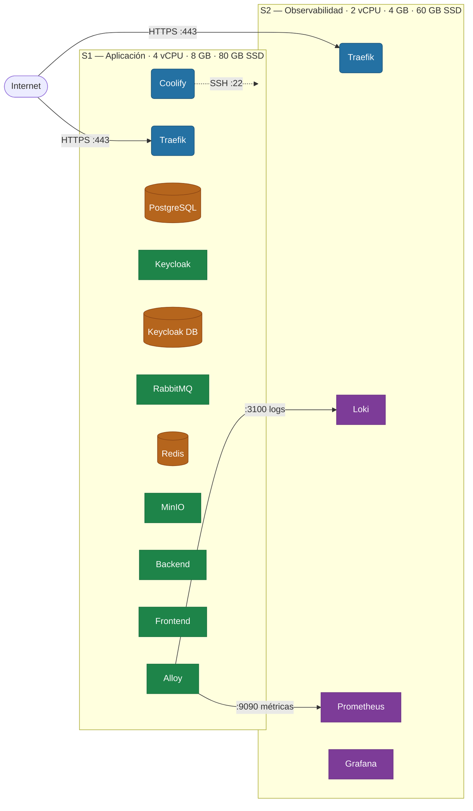
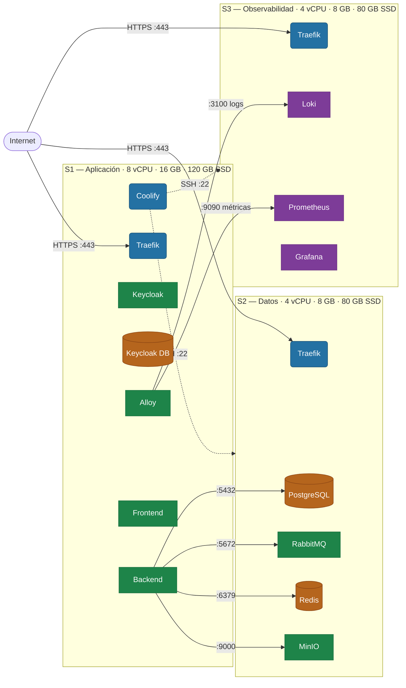
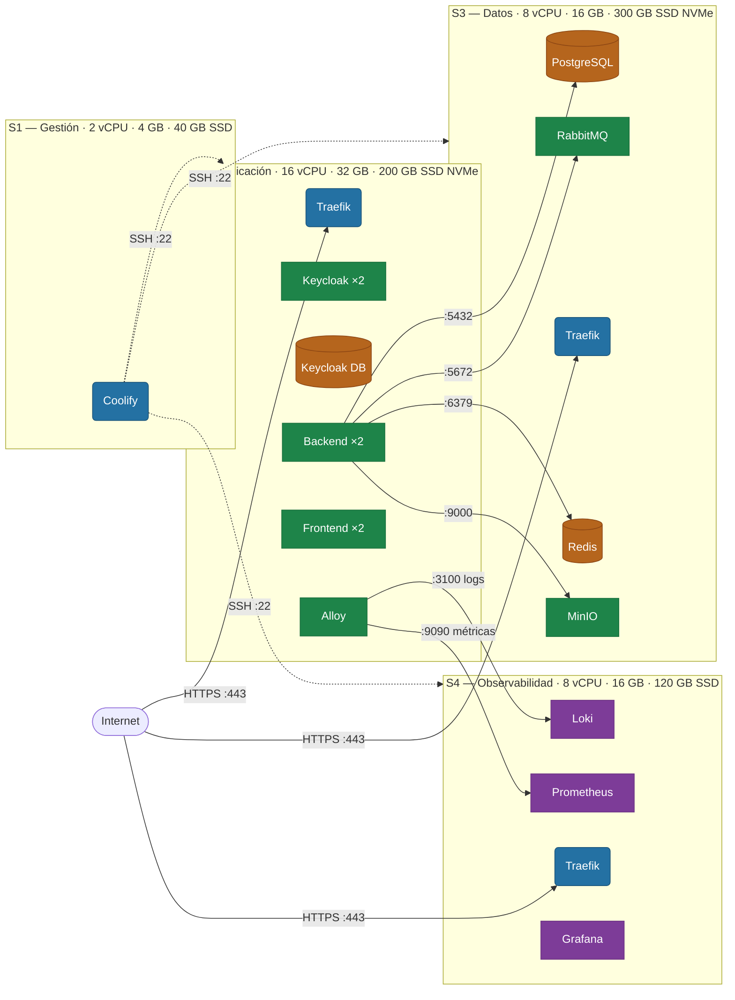

# Arquitectura de Despliegue Distribuido — Coolify

Recomendación de distribución de servicios entre servidores para ambiente de producción.
Los recursos de CPU y RAM de cada escenario corresponden a las tablas de [RECURSOS.md](RECURSOS.md).

Coolify gestiona todos los servidores adicionales vía SSH desde el servidor donde está instalado.
En cada servidor gestionado, Coolify despliega automáticamente una instancia de Traefik que actúa
como proxy inverso local y emite certificados TLS vía Let's Encrypt.

---

## Escenario 1 — Básico · 2 servidores

**Referencia de recursos:** Tabla 1 de RECURSOS.md (~200 usuarios concurrentes)

Todos los servicios de aplicación y datos corren en S1. S2 está dedicado exclusivamente a
observabilidad para no competir por CPU/RAM con el tráfico de usuarios en momentos de alta carga.

### Capacidades de servidores

| Servidor | Rol | vCPU | RAM | Disco |
|----------|-----|:----:|:---:|:-----:|
| S1 | Aplicación + Datos | 4 | 8 GB | 80 GB SSD |
| S2 | Observabilidad | 2 | 4 GB | 60 GB SSD |

### Servicios por servidor

| Servidor | Servicio | Réplicas | Expuesto a Internet |
|----------|----------|:--------:|:-------------------:|
| S1 | Coolify (plataforma) | 1 | No (SSH tunnel) |
| S1 | Traefik | 1 | Sí (:443) |
| S1 | PostgreSQL | 1 | No |
| S1 | Keycloak | 1 | Sí (`keycloak.arquisoft.top`) |
| S1 | Keycloak DB | 1 | No |
| S1 | RabbitMQ | 1 | Sí (`rabbitmq.arquisoft.top`) |
| S1 | Redis | 1 | No |
| S1 | MinIO | 1 | Sí (`minio.arquisoft.top`) |
| S1 | Backend (Spring Boot) | 1 | Sí (`api.arquisoft.top`) |
| S1 | Frontend | 1 | Sí (`arquisoft.top`) |
| S1 | Grafana Alloy | 1 | No |
| S2 | Loki | 1 | No |
| S2 | Prometheus | 1 | No |
| S2 | Grafana | 1 | Sí (`grafana.arquisoft.top`) |

### Conexiones entre servidores

| Origen | Destino | Puerto | Protocolo | Propósito |
|--------|---------|:------:|:---------:|-----------|
| S1 — Coolify | S2 | 22 | SSH | Gestión y despliegue de Coolify |
| S1 — Alloy | S2 — Loki | 3100 | HTTP | Push de logs del backend |
| S1 — Alloy | S2 — Prometheus | 9090 | HTTP | Push de métricas del sistema |

---

## Escenario 2 — Distribuido · 3 servidores

**Referencia de recursos:** Tabla 2 de RECURSOS.md (~200–500 usuarios concurrentes)

Los servicios de datos (PostgreSQL, RabbitMQ, Redis, MinIO) se separan a un servidor dedicado.
Esto permite escalar o respaldar la capa de datos de forma independiente sin afectar la disponibilidad
de la aplicación. S1 concentra la lógica de negocio y el enrutamiento.

### Capacidades de servidores

| Servidor | Rol | vCPU | RAM | Disco |
|----------|-----|:----:|:---:|:-----:|
| S1 | Aplicación | 8 | 16 GB | 120 GB SSD |
| S2 | Datos | 4 | 8 GB | 80 GB SSD |
| S3 | Observabilidad | 4 | 8 GB | 80 GB SSD |

### Servicios por servidor

| Servidor | Servicio | Réplicas | Expuesto a Internet |
|----------|----------|:--------:|:-------------------:|
| S1 | Coolify (plataforma) | 1 | No (SSH tunnel) |
| S1 | Traefik | 1 | Sí (:443) |
| S1 | Keycloak | 1 | Sí (`keycloak.arquisoft.top`) |
| S1 | Keycloak DB | 1 | No |
| S1 | Backend (Spring Boot) | 1 | Sí (`api.arquisoft.top`) |
| S1 | Frontend | 1 | Sí (`arquisoft.top`) |
| S1 | Grafana Alloy | 1 | No |
| S2 | PostgreSQL | 1 | No |
| S2 | RabbitMQ | 1 | Sí (`rabbitmq.arquisoft.top`) |
| S2 | Redis | 1 | No |
| S2 | MinIO | 1 | Sí (`minio.arquisoft.top`) |
| S2 | Traefik | 1 | Sí (:443) |
| S3 | Loki | 1 | No |
| S3 | Prometheus | 1 | No |
| S3 | Grafana | 1 | Sí (`grafana.arquisoft.top`) |
| S3 | Traefik | 1 | Sí (:443) |

### Conexiones entre servidores

| Origen | Destino | Puerto | Protocolo | Propósito |
|--------|---------|:------:|:---------:|-----------|
| S1 — Coolify | S2 | 22 | SSH | Gestión y despliegue de Coolify |
| S1 — Coolify | S3 | 22 | SSH | Gestión y despliegue de Coolify |
| S1 — Backend | S2 — PostgreSQL | 5432 | TCP | Consultas SQL |
| S1 — Backend | S2 — RabbitMQ | 5672 | TCP (AMQP) | Publicación y consumo de mensajes |
| S1 — Backend | S2 — Redis | 6379 | TCP | Caché de sesiones y datos |
| S1 — Backend | S2 — MinIO | 9000 | HTTP | API S3 (objetos y artefactos) |
| S1 — Alloy | S3 — Loki | 3100 | HTTP | Push de logs del backend |
| S1 — Alloy | S3 — Prometheus | 9090 | HTTP | Push de métricas del sistema |

---

## Escenario 3 — Alta Disponibilidad · 4 servidores

**Referencia de recursos:** Tabla 3 de RECURSOS.md (>500 usuarios concurrentes)

Coolify se aísla en un servidor de gestión dedicado (S1). La capa de aplicación (S2) corre con
réplicas horizontales del Backend, Frontend y Keycloak para tolerancia a fallos. S3 concentra toda
la persistencia. S4 garantiza que la observabilidad no compite con el tráfico de producción.

### Capacidades de servidores

| Servidor | Rol | vCPU | RAM | Disco |
|----------|-----|:----:|:---:|:-----:|
| S1 | Gestión (solo Coolify) | 2 | 4 GB | 40 GB SSD |
| S2 | Aplicación | 16 | 32 GB | 200 GB SSD NVMe |
| S3 | Datos | 8 | 16 GB | 300 GB SSD NVMe |
| S4 | Observabilidad | 8 | 16 GB | 120 GB SSD |

> El disco de S3 es el más grande porque contiene los volúmenes de PostgreSQL, MinIO y
> los datos de RabbitMQ. Usar NVMe en S3 reduce la latencia de escritura de PostgreSQL y
> MinIO de ~1 ms (SSD SATA) a ~0.1 ms, perceptible en cargas de subida de artefactos.

### Servicios por servidor

| Servidor | Servicio | Réplicas | Expuesto a Internet |
|----------|----------|:--------:|:-------------------:|
| S1 | Coolify (plataforma) | 1 | No (acceso por IP fija o VPN) |
| S2 | Traefik | 1 | Sí (:443) |
| S2 | Backend (Spring Boot) | 2 | Sí (`api.arquisoft.top`) |
| S2 | Frontend | 2 | Sí (`arquisoft.top`) |
| S2 | Keycloak | 2 | Sí (`keycloak.arquisoft.top`) |
| S2 | Keycloak DB | 1 | No |
| S2 | Grafana Alloy | 1 | No |
| S3 | PostgreSQL | 1 | No |
| S3 | RabbitMQ | 1 | Sí (`rabbitmq.arquisoft.top`) |
| S3 | Redis | 1 | No |
| S3 | MinIO | 1 | Sí (`minio.arquisoft.top`) |
| S3 | Traefik | 1 | Sí (:443) |
| S4 | Loki | 1 | No |
| S4 | Prometheus | 1 | No |
| S4 | Grafana | 1 | Sí (`grafana.arquisoft.top`) |
| S4 | Traefik | 1 | Sí (:443) |

### Conexiones entre servidores

| Origen | Destino | Puerto | Protocolo | Propósito |
|--------|---------|:------:|:---------:|-----------|
| S1 — Coolify | S2 | 22 | SSH | Gestión y despliegue de Coolify |
| S1 — Coolify | S3 | 22 | SSH | Gestión y despliegue de Coolify |
| S1 — Coolify | S4 | 22 | SSH | Gestión y despliegue de Coolify |
| S2 — Backend | S3 — PostgreSQL | 5432 | TCP | Consultas SQL |
| S2 — Backend | S3 — RabbitMQ | 5672 | TCP (AMQP) | Publicación y consumo de mensajes |
| S2 — Backend | S3 — Redis | 6379 | TCP | Caché de sesiones y datos |
| S2 — Backend | S3 — MinIO | 9000 | HTTP | API S3 (objetos y artefactos) |
| S2 — Alloy | S4 — Loki | 3100 | HTTP | Push de logs del backend |
| S2 — Alloy | S4 — Prometheus | 9090 | HTTP | Push de métricas del sistema |

---

## Resumen de puertos por firewall

### Puertos abiertos desde Internet (en cada escenario)

| Puerto | Protocolo | Servidor (Esc. 1) | Servidor (Esc. 2) | Servidor (Esc. 3) |
|:------:|:---------:|:-----------------:|:-----------------:|:-----------------:|
| 443 | HTTPS | S1 | S1, S2, S3 | S2, S3, S4 |
| 80 | HTTP | S1 | S1, S2, S3 | S2, S3, S4 |

> El puerto 80 es necesario para la validación HTTP-01 de Let's Encrypt. Traefik
> lo redirige automáticamente a HTTPS; no sirve tráfico de aplicación en claro.

### Puertos abiertos solo entre servidores (red privada)

| Puerto | Protocolo | Servicio | Abierto en |
|:------:|:---------:|---------|-----------|
| 22 | SSH | Coolify → servidores gestionados | Todos los servidores (origen: solo IP de Coolify) |
| 5432 | TCP | PostgreSQL | S1 (Esc. 1) · S2 (Esc. 2) · S3 (Esc. 3) |
| 5672 | TCP | RabbitMQ AMQP | S1 (Esc. 1) · S2 (Esc. 2) · S3 (Esc. 3) |
| 6379 | TCP | Redis | S1 (Esc. 1) · S2 (Esc. 2) · S3 (Esc. 3) |
| 9000 | HTTP | MinIO S3 API | S1 (Esc. 1) · S2 (Esc. 2) · S3 (Esc. 3) |
| 3100 | HTTP | Loki push | S2 (Esc. 1) · S3 (Esc. 2) · S4 (Esc. 3) |
| 9090 | HTTP | Prometheus write | S2 (Esc. 1) · S3 (Esc. 2) · S4 (Esc. 3) |

> Los puertos de datos (5432, 5672, 6379, 9000) y observabilidad (3100, 9090) **no deben
> estar abiertos a Internet**. Configurar reglas de firewall que los restrinjan a la IP
> privada del servidor de origen correspondiente.
